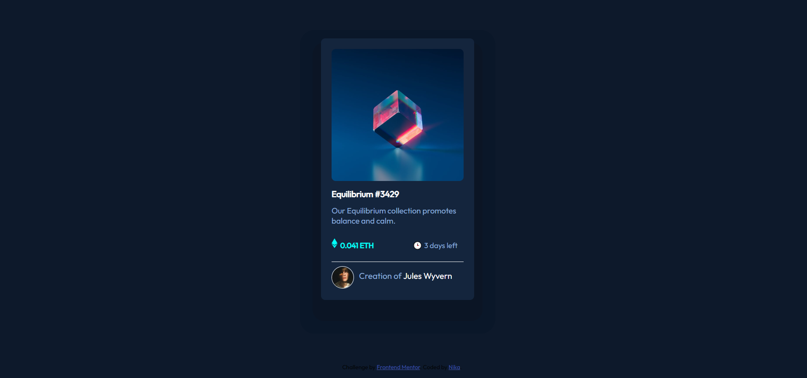

# NFT-challenge
# Frontend Mentor - NFT preview card component solution

This is a solution to the [NFT preview card component challenge on Frontend Mentor](https://www.frontendmentor.io/challenges/nft-preview-card-component-SbdUL_w0U). Frontend Mentor challenges help you improve your coding skills by building realistic projects. 

## Table of contents

  - [Screenshot](#screenshot)
  - [Links](#links)
  - [Built with](#built-with)
  - [What I learned](#what-i-learned)
  - [Author](#author)

### Screenshot

### Links

- Solution URL: [Add solution URL here](https://your-solution-url.com)
- Live Site URL: [Add live site URL here](https://your-live-site-url.com)

### Built with
HTML5
CSS

### What I learned

Adding box-shadows to elements.
## Author

- Website - [Add your name here](https://https://nikakl.github.io/CV/)
- Frontend Mentor - [@yourusername](https://www.frontendmentor.io/profile/NIKAKL)

